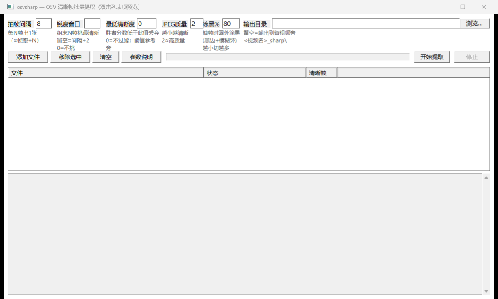

# osvsharp — OSV 视频清晰帧批量提取工具

从 DJI Osmo 360 的 `.OSV` 双目全景视频（或普通 mp4/mov/mkv 等视频）中，**边解码边筛选，只导出清晰的帧**。单文件纯 C99 实现（约 1900 行，Win32 API），不依赖任何第三方动态库；HEVC 解码通过子进程调用 ffmpeg 完成；遮罩 PNG 生成用内嵌的公有领域 stb 单头写库。



## 特性

- **输入 OSV 直出**：无需先用 DJI 官方工具拆解，直接拖入 `.OSV` 文件
- **清晰帧筛选**：对每帧计算 512×512 亮度缩略图的拉普拉斯方差（与 spirula-studio 的 GPU 实现同一算法），滑窗内只保留最锐一帧——运动模糊、抖动、对焦爬升期的帧自动淘汰
- **边缘涂黑**：抽帧编码时同步把每帧中心圆外的像素涂黑（半径百分数可设，默认 80%），切掉鱼眼黑边与紧贴黑边的失焦模糊环——涂黑并入编码滤镜（单次编码、无二次损失、几乎不耗时），涂黑区不产生图像梯度，SfM 特征点天然落不进去，等价于给三维重建喂 mask
- **双目帧号配对**：两路鱼眼分别导出到 `cam0/`、`cam1/`，文件名即源视频帧号，同号即同一时刻，方便全景拼接 / 三维重建配对
- **显卡硬解**：自动探测 NVIDIA CUDA → Vulkan → D3D11VA，全部失败退回 CPU 软解（实测 8K 双目硬解比软解快约 5 倍）
- **批量处理**：图形界面支持拖入多个文件逐个处理，可随时停止
- **缩略图预览**：双击列表项弹出 12 格剧情缩略图（按视频时长均匀 `-ss` 取样，附时长/分辨率/双目信息）——U 盘里一堆无规律文件名，先预览再决定处理哪个
- **单帧审计**：每帧评分导出为 CSV，可事后核对、调整门槛重跑
- **绿色单文件**：`osvsharp.exe` 约 420 KB，与 `ffmpeg.exe` 放在同一目录即可，无需安装

## 使用

### 图形界面

双击 `osvsharp.exe`（或从 [Releases](../../releases) 下载压缩包整体解压后运行）：

1. 把一个或多个视频拖进窗口，或点「添加文件」
2. 双击列表项可预览视频内容（12 格缩略图 + 时长/分辨率）
3. 点「开始提取」
4. 结果输出在每个视频旁边：`<视频名>_sharp/cam0、cam1、sharpness_camN.csv`

| 参数 | 含义 | 默认 |
|---|---|---|
| 抽帧间隔 | 每隔多少源帧输出一张（25fps 视频填 8 ≈ 每秒 3 张） | 8 |
| 锐度窗口 | 每个输出位置往前多少帧里选最清晰的一帧；留空 = 自动（约间隔一半） | 自动 |
| 最低清晰度 | 得分低于该值的帧即使窗口内最优也不输出，用于剔除开机抖动段；先跑一遍看 CSV 分布再定 | 0（关闭） |
| JPEG 质量 | 同 ffmpeg `-q:v`，越小越清晰文件越大 | 2 |
| 涂黑半径% | 抽帧编码时同步把每帧中心圆外涂黑（单次编码、无二次损失、几乎不耗时）：保留半径 = 百分数 × 短边 ÷ 2，切掉黑边 + 失焦模糊环。百分数越小切得越多（保留面积 ≈ 百分数的平方：80%→64%、88%→77%）。参考：Osmo 360 样帧实测清晰边界约 93%，默认 80 已留足余量，想少切一点可往 84~88 调 | 80 |
| 输出目录 | 留空 = 各视频旁边 | 空 |

### 命令行

把视频拖到 `osvsharp.exe` 图标上即可直接处理（结束后等回车关闭）；脚本调用：

```
osvsharp.exe 视频1.OSV 视频2.OSV [选项]
  -s <n>   抽帧间隔          -k <n>   锐度窗口
  -m <f>   最低清晰度        -q <n>   JPEG 质量
  -mask <n> 边缘涂黑半径%（抽帧编码时同步执行，0=不涂黑）
  -o <dir> 输出目录          --hwaccel cuda|vulkan|d3d11va|none
  --nopause 脚本调用时不等待回车
```

## 工作原理

```
┌─ 探测：ffmpeg 各硬解方案试解 1 帧，选定 cuda/vulkan/d3d11va/软解
│
├─ Pass A：解码 → 512×512 灰度缩略图（管道，不落盘）
│          → 每帧拉普拉斯方差评分
│          → 滑窗选帧：每 skip 帧输出窗内（keep 帧）得分最高者
│
└─ Pass B：再解码一遍 → MJPEG 流过管道
           → C 端按帧号比对获胜列表，只写获胜帧（按源帧号命名）
           → 涂黑开启时滤镜链挂全分辨率圆形遮罩 + maskedmerge，
             在这次（也是唯一一次）编码前把圆外清黑
```

中间帧全部走内存管道，磁盘上只出现最终选中的清晰帧。

清晰度指标与滑窗算术移植自 spirula-studio 的 `src/video/shaders/video.slang` 与 `src/app/FrameExtract.cpp`。

## 编译

Windows（clang/MSVC 均可，C99，无第三方库）：

```
clang -std=c99 -O2 -D_CRT_SECURE_NO_WARNINGS osvsharp.c -o osvsharp.exe
```

运行时需要 `ffmpeg.exe`（查找顺序：同目录 → `FFMPEG` 环境变量 → PATH）。Releases 里的压缩包已附带实测过的 [ffmpeg 9.0](https://www.gyan.dev/ffmpeg/builds/)（GPL，源码见其官网）。

## 许可

- osvsharp 本体：[MIT License](LICENSE)
- 分发包内附带的 ffmpeg 遵循 GPL，源码与许可见 <https://www.gyan.dev/ffmpeg/builds/>
